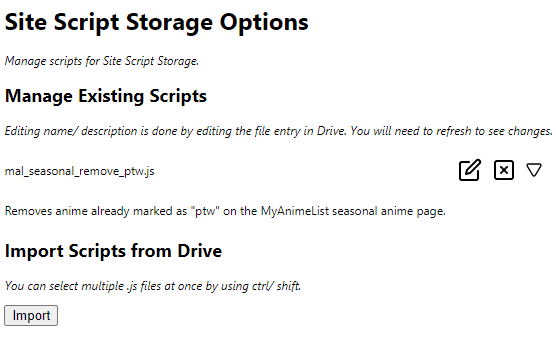

# Site Script Storage

A Google Chrome extension that lets you import .js files from Google Drive, and run them as content scripts on websites.

Options page:

Script runner:

## Setup

I haven't put in the time to have this application be verified by Google. As a result, it's not on the Chrome Web Store, and there's a limitation of 100 users for the APIs it uses (https://support.google.com/cloud/answer/7454865). To try this extension, you can set up the keys with your own account (see the Keys.json section)

### Building and Running

- Install using `npm`.
- You will need a `keys.json` file in the repo root (more on the actual values later). See `keys-example.json` for the correct format.
- Run `npm run start-dev` (or `npx webpack --config webpack.prod.js` for a prod build). This will generate browser-compatible JS into `gen/`.
- In Chrome, go to `chrome://extensions`, click "Load unpacked", and select `gen/`.

### Keys.json

- Chrome Web Store Developer Dashboard
    - Create an entry for the extension. Get the public key for the extension and copy it into `keys.json`. In the old view, click on "More info" to see the public key.
- Google APIs Developer Console
    - Create a new project. Get the project number (IAM & Admin -> Settings -> Project Number) and copy it into `keys.json`.
    - Create an API Key. Copy the key into `keys.json`.
    - Create an OAuth 2.0 Client ID. Copy the Client ID into `keys.json`.

## Notes

### Content Script Limitations

Site Script Storage uses [content scripts](https://developer.chrome.com/extensions/content_scripts) to run code. As a result, it shares the same limitations as content scripts do, the most important of which is that it cannot access the JavaScript executed by the page (including libraries like jQuery), it can only access the DOM.

### Cross Site Scripting

This extension is by nature insecure, as it's running arbitrary code in a webpage, which can lead to attacks if the user runs a malicious script. Make sure you know what the scripts you are running do.

### Revoking Account Access

Since this hasn't been verified by Google, it shows in the Google Account security checkup as "risky third party access". Removing access here causes issues with the extension, I believe because Chrome still stores an access token for the extension, but that access token doesn't actually work. The workaround for this is to go to `chrome://identity-internals/` and manually revoke access for the extension.

## Credits

SVG for all icons used taken from https://feathericons.com/.
